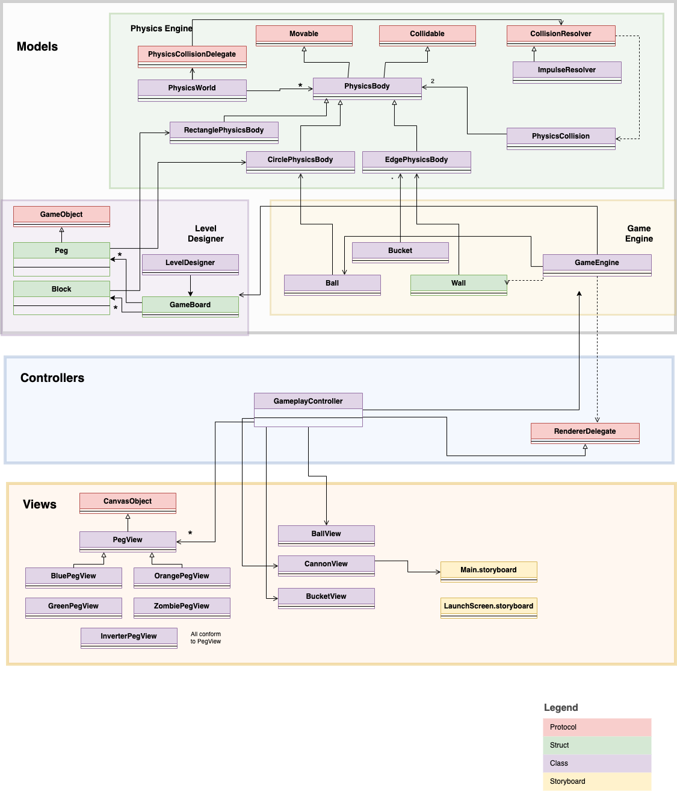
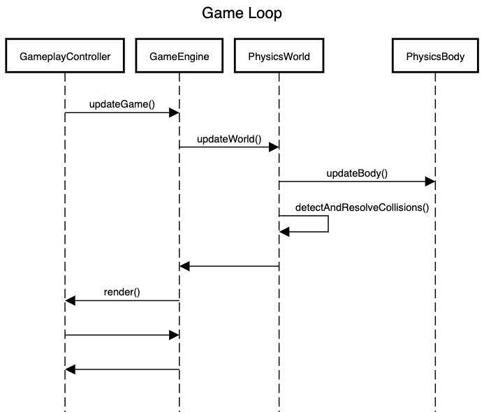
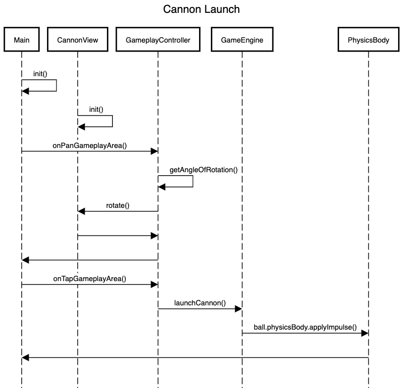

# Asteroid Strike

## How to Play
*Asteroid Strike* is a space-themed Peggle clone where the player launches a cannon and tries to hit all the targets with a limited number of balls. 

You can watch a demo of the gameplay at:  [Asteroid Strike](https://youtu.be/dvfQEP6nmpc)

 [](https://youtu.be/dvfQEP6nmpc)

### Cannon Direction
The ball can be launched by first aiming the cannon and then triggering the launch as follows:

1. Pan/drag across the gameplay area, to aim the cannon towards the location of the pan gesture. The cannon will tilt to indicate the direction it is pointing towards.

2. Tap on the gameplay area to launch the cannon in the existing direction of the cannon. 

By dragging/panning across the screen, the cannon can be aimed in all directions from left to down to right. It cannot be aimed upwards. In usual mathematical graphs, if the cannon is at the origin, the angles allowed are in the third and fourth quadrants.

The cannon cannot be launched when the previous launch is not completed yet.

### Win and Lose Conditions

#### Classic Mode
* Win condition: All orange pegs (Mars planets) are cleared.
* Lose condition: All balls are used up and there is at least one orange peg (Mars planet) left.

#### Beat The Score Mode
* Win condition: The player's score is higher than the target score before or at the time when the timer is complete. If the ball has not exited the gameplay area yet when the timer is up, the glowing pegs are still counted in the score.
* Lose condition: The player's score is lower than the target score when the timer is complete. 

#### Siam Left, Siam Right Mode
* Win condition: No more balls are left and none of the pegs were hit or lit up.
* Lose condition: A peg has been hit or lit up.


### Powerups

#### Ka-Boom
The ka-boom powerup is the default powerup for all modes except 'Classic Spooky Ball'. On hitting a green peg, the peg explodes and lights up all nearby pegs. This explosion could also be a chain reaction.

#### Spooky Ball
For every time a green peg is hit, the ball appears on the top of the screen with the same x coordinate as it left. If multiple green pegs are hit in the same launch, the ball reappears at the top multiple times according to the powerup count.

### Spicy Pegs

#### Zombie pegs
In a peg with at least 10 pegs, a random non-orange peg is converted to a zombie peg. When the ball hits a zombie peg, it is converted to another ball. The zombie peg is removed from the screen.

#### Confusement pegs (Inverter peg)
In a peg with at least 20 pegs, a random non-orange peg is converted to an inverter peg. When the ball hits a inverter peg, the gameplay area is rotated 180 degrees. The cannon and bucket are still in the same location. However, the ball is launched from below and the bucket catches from above, causing 'confusion'.

### Moving Bucket
The bucket oscillates between the left and right edges of the screen at constant speed. When the ball enters the bucket from the top, it disappears from the gameboard. When the ball hits the side of the bucket, it will get deflected. 

For classic mode, a ball is given. For beat the score mode, 5 seconds are added. For siam mode, a ball is reduced. 

When spooky ball is on, the bucket adds a ball and teleports the ball to the top of the board. When inverted (confusement) peg is activated, the bucket is shown below but is actually on top of the screen.
## Level Designer Additional Features

### Peg Rotation
Both circular pegs and rectangular blocks can be rotated. 

To rotate a peg or block, tap on it in the level designer. There will be a rotation slider in the bottom-right UI of the screen. The peg or block can be roatted to a full 360 degrees or any angle in between.

### Peg Resizing
To resize a peg or block, tap on it in the level designer. There will be resize sliders in the bottom-right UI of the screen. For circular pegs, there is a size slider, and for rectangular blocks, there are 2 sliders for both height and width. The peg or block can be resized to any size upto 4 times its original size in area.

## Bells and Whistles
### Theme
Space theme is used throughout the game. 
* Balls are asteroids
* Pegs are planets
* Rectangular blocks are unarmed spaceships
* The bucket is a blackhole

### Gameplay UI
Added UI to show the user the following information:
* Number of balls left
* Number of orange pegs left
* Score
* Timer
These are shown or hidden based on the game mode.

## Dev Guide
*Asteroid Strike* is an iPad app built following the **Model-View-Controller (MVC)** framework. It uses **Storyboards** with auto-layout for responsive UI views. For updating the views based on the model, it follows the Observer pattern. Responsibilities are segregated using the Delegate pattern. The app was built as an extension to the *Level Designer* app from Problem Set 2 and *Core Gameplay* from Problem Set 3.

This developer guide is intended for other developers to understand the architecture and design of the app. It includes the following sections:
1. Overall Architecture
2. Physics Engine
3. Game Engine
4. Renderer
5. Game Loop

### Overall Architecture

#### Class Diagram

The class diagram is given below. This is relevant to the gameplay of the app.



The architecture of the app is as follows:

The `Models` contain:
1. `PhysicsEngine` models
2. `GameEngine` models
3. `LevelDesigner`models 

The `Controllers` contains a single controller for the `Gameplay` screen.

The `Views` contain mostly `UIImageView`s that are rendered on the screen as per the game engine's state, by the view controller.

### Physics Engine
The physics engine is responsible for simulating the physics of the game. The physics engine consists of the physics world which has a collection of physics bodies. It updates the physics bodies based on the linear forces and impulses applied to them, by conforming to `Movable`. It also updates based on collisions between bodies by conforming to `Collidable`. Collsions are detected based on intersections of `CGPath`s.On collision, the impulse and position are calculated based on the type of physics body in the `PhysicsCollsion` class and resolved by the `CollisionResolver`s.

The physics bodies currently supported are: `CirclePhysicsBody`, `EdgePhysicsBody`, and `RectanglePhysicsBody`.

The coordinate system for the physics engine is different from the usual mathematical coordinate system. The top left most position is considered the origin, and the y-axis is inverted. Hence, downwards would be positive y-axis, and towards the right would be positive x-axis. 

### Game Engine
The game engine consists of the `physicsWorld`, `gameplayArea`, `gameBoard`, and `rendererDelegate`. It controls the game mechaninics and is the heart of the game. The circular physics body is used by balls and pegs, whereas the edge-based body is used by the walls of the gameplay area. The gameplay elements (cannon, ball, walls), and gameboard elements (pegs) are controlled here. It delegates the rendering repsonsibility. It also consists of the game loop.

The game engine also has some special helper classes. These are:

* `GameStats`: This keeps track of the game stats like the number of balls left, the score, and the number of pegs left.

* `GameMode`: This is a protocol, amd has all the 3 game mode classes conform to it. It keeps track of things like win and lose conditions, and other mode-specific logic such as entering the bucket.

* `Powerup`: This is a protocol, and has the 2 powerup classes conform to it. It keeps track of whether the powerup has been activated and handles the powerup logic. 

* `PhysicsBodyCategory`: This class heps categorise the physics bodies in the game engine to apply custom logic to them on collision, for example, explosions.

### Renderer
The `RendererDelegate` protocol has the following responsibilities:
```
protocol RendererDelegate {
    func render()
    func isRendererAnimationComplete() -> Bool
    func toggleGameboardOrientation()
}
```

This delegates the responsibility of rendering what is computed in the Game Engine to appear on the renderer. This also allows the game engine to know if the renderer has completed its animations and is ready for the next launch.

In the current implementation, `GameplayController` conforms to `RendererDelegate` and updates the view controller as per the game engine:

```
func render() {
        updateMovingObjects()
        lightUpHitPegs()
        fadeOutRemovedObjects()
        fadeOutLitPegsOnLaunchEnd()
        updateGameStats()
        showGameMessages()
}
```

#### How ball launch works
The ball can be launched by first aiming the cannon and then triggering the launch as follows:

1. Pan/drag across the gameplay area, to aim the cannon towards the location of the pan gesture. The cannon will tilt to indicate the direction it is pointing towards.

2. Tap on the gameplay area to launch the cannon in the existing direction of the cannon. 

By dragging/panning across the screen, the cannon can be aimed in all directions from left to down to right. It cannot be aimed upwards. In usual mathematical graphs, if the cannon is at the origin, the angles allowed are in the third and fourth quadrants.

### Game Loop
The game loop updates the game as time passes by and has the following responsibilities:
```
    @objc func updateGame() {
        handleGameLogic()
        physicsWorld.updateWorld()
        rendererDelegate?.render()
    }
```

### Execution Flow

This is how the game loop works:



The sequence diagram of how a cannon ball is launched is as follows:



## Tests
The test plan for *Asteroid Strike* consists on unit tests and end-to-end testing. The models can be unit tested whereas the contorllers and views and tested during manual playtesting.

### Unit Tests
The models are tested using unit tests:

For `Gameboard` and `Peg` tests, please refer to Level Designer (Problem Set 2) unit tests. Here are the tests for the new models from the Physics Engine and Game Engine:

#### Physics Engine
1. `PhysicsWorld`

- `addPhysicsBody()`
  - Adding a `PhysicsBody` should add it to the `physicsBodies` array.
  - Re-adding a `PhysicsBody` should add it to the `physicsBodies` array.

- `removePhysicsBody()`
  - Removing a `PhysicsBody` should remove it from the `physicsBodies` array.
  - Removing a `PhysicsBody` that is not in the `physicsBodies` array should do nothing.

- `findPhysicsBody()`
  - Finding a `PhysicsBody` that is in the `physicsBodies` array should return the `PhysicsBody`.
  - Finding a `PhysicsBody` that is not in the `physicsBodies` array should return `nil`.

- `getBodiesInContact()`
  - Place a physics body such that it is intersecting another physics body(ies). Calling `getBodiesInContact()` should return these intersecting physics body(ies) as an array.

- `updateWorld()`
  - Add a physics body to the world. Add another physics body such that it intersects the first body. Calling  `updateWorld()` should update the position and velocity of both physics bodies according to the default gravitational force, and the collision resolution.

2. `PhysicsBody`
- `updateBody`
  - Set the body's velocity to be non-zero. Calling `updateBody()` should update the physics body's position and velocity according to the default gravitational force.

- `applyForce()`
  - Set the body's `isDynamic` to be true. Calling `applyForce()` should update the physics body's forces, hence velocity should update continously based on the force.
  - Set the body's `isDynamic` to be false. Calling `applyForce()` should do nothing.

- `applyImpulse()`
  - Set the body's `isDynamic` to be true. Calling `applyImpulse()` should update the physics body's velocity for once based on the impulse.
  - Set the body's `isDynamic` to be false. Calling `applyImpulse()` should do nothing.

- `detectCollision()`
  - Calling `detectCollision()` of one physics body with the same physics body as an argument should return `nil`.
  - Calling `detectCollision()` of one physics body with another physics body that is intersecting it and moving towards it as an argument should return a `PhysicsCollision` object.
  - Calling `detectCollision()` of one physics body with another physics body that is intersecting it and moving away from it as an argument should return `nil`.
  - Calling `detectCollision()` of one physics body with another physics body that is not intersecting it as an argument should return `nil`.

- `CirclePhysicsBody`
  - Initializing with a radius and center should create a circle physics body with the specified radius and center.

- `EdgePhysicsBody`
  - Initialising with a source and destination point should create a linear/edge physics body with the specified source and destination point.

- `RectanglePhysicsBody`
`init()`
  - Initializing with a rect and angle should create a rectangle physics body as specified.

3. `PhysicsCollision`
- `init()`
  - Given two physics bodies, initializing a `PhysicsCollision` object calculates some collision data like normal and impulse. This can be verified with the actual normal and impulse values between the two physics bodies. This should be successful for all combinations of physics bodies from:
    - `CirclePhysicsBody` and `CirclePhysicsBody`
    - `CirclePhysicsBody` and `EdgePhysicsBody`
    - `EdgePhysicsBody` and `CirclePhysicsBody`
  This should do nothing for other combinations such as:
    - `EdgePhysicsBody` and `EdgePhysicsBody`
    - Physics bodies that do not conform to any of the accepted subclasses.

- `resolveCollision()`
  - Given an empty list of resolvers, calling `resolveCollision()` should do nothing.
  - Given a list of resolvers, calling `resolveCollision()` should call the `resolve()` method of each resolver in the list.

4. `CollisionResolver`

- `resolve()`
  - Given a `PhysicsCollision` object, calling `ImpulseResolver`'s `resolve()` should update the velocities of the two physics bodies in the collision according to the collision resolution algorithm by applying impulse from the calculated physics collision data.

#### Game Engine
1. `GameEngine`
- `init()`
  - Initializing without renderer as `GameEngine(gameboard: gameboard, gameplayArea: gameplayArea.bounds)` should be successful
  - Initializing with renderer as `GameEngine(gameboard: gameboard, gameplayArea: gameplayArea.bounds, renderer: renderer)` should also be successful

- `launchCannon()`
  - Set ball location outside gameplay area and make sure all pegs' `isHit` property is false. Calling `launchCannon()` should launch the cannon ball. This can be verified by checking that the ball was applied the impulse of the launch.
  - Set ball location outside gameplay area and make the set of pegs empty. Calling `launchCannon()` should launch the cannon ball.
  - Set ball location at the gameplay area bounds such that the center is outside, but the ball is still seen. Make sure all pegs' `isHit` property is false. Calling `launchCannon()` should do nothing.
  - Set ball location within gameplay area. Calling `launchCannon()` should do nothing.
  - Set any one or more of the pegs' property of `isHit` to `true`. Calling `launchCannon()` should do nothing.

- `updateGame()`
This method is used as the game loop. It is more suitable for integration tests, but some unit tests for it could be as follows:
  - Set some pegs' `isHit` property to be `true`. Calling `updateGame()` should remove all of these `isHit == true` pegs from the gameboard. 

2. `Ball`
- `init()`
  - Initializing with no arguments should create a Ball with the default radius and default height.
  - Initializing with a radius and height should create a Ball with the specified radius and height.
  - Initializing with a radius and no height should create a Ball with the specified radius and default height.
  - Initializing with a height and no radius should create a Ball with the specified height and default radius.

- `isStuck()`
This method is more suitable for integration tests as it depends on whether the ball has been stuck for a period of time.

3. `Wall`
- `init()`
  - Initializing with a `RectangleEdge.edge` type as an argument should create a wall with the specified edge as a physics body, and sets its physics properties.

### Integration Tests
#### Home Screen
1. Buttons
- The 'Start Game' button should be enabled.
- Clicking on the 'Start Game' button should navigate to the 'Gameplay' page.
- The 'Design Level' button should be enabled.
-`Clicking on the 'Design Level' button should navigate to the 'Design Level' page.
- Tapping anywhere else should not navigate to any other page or do anything.

2. Unwind to Menu
- Unwinding or returning to the home screen from any of the other page should still have the same behavior as above. There should be no back button to return from home page to anywhere else.

#### Gameplay
Please create an appropriate test level as needed.

Go to the Gameplay page by clicking on the 'Start Game' button on the Home Screen, and then selecting a preloaded or saved level. 

1. Game Mode
- On navigating to the gameplay screen, an alert should pop up asking the user to select a game mode or powerup style. The 4 following options should be available:
  - Classic Ka-Boom
  - Classic Spooky Ball
  - Beat the Score
  - Siam Left, Siam Right
- Selecting any of the options should dismiss the alert and start the game in the selected mode.

2. Cannon launch
- The cannon should be visible in the top center of the screen. Dragging across the screen should chnage the direction of the cannon in the location of the drag gesture. It can only be rotated to the any angles in the third and fourth quadrant mathematically. 
- Tapping anywhere on teh screen should launch the cannon in the existing direction. It should have both the cannon impulse and gravity applied to it. This can be seen by launching on the sides, and the ball curved in a parabola.
- When the ball hits a blue/orange/green peg, they light up. When the ball hits a block, it bounces off it as it is only an obstacle. The pegs and blocks are not removed unless they are blocking the ball for about 3 seconds.
- Trying to launch the cannon when the ball is on the screen does not work.
- Trying to launch the cannon when the ball has left the screen but the glowing pegs are still animating to disppear does not work.
- The cannon can only be launched after the glowing peg views have disappeared.
- When inverted (confusement) peg is actiavted, the cannon is shown above but is actually on the bottom of the screen.

3. Physics
- Collisions can happen with pegs, blocks, walls, bucket and the ball. Ony the ball and bucket are moving. The cannon does not have a physics body.
- When the ball is trapped, the pegs or blocks in contact with it are removed from the gameboard so that it can fall down.
- When the ball hits a rotated rectangular block, it bounces off based on the new rotated edges instead of AABB edges. 
- On collsion, energy is only lost, except for when it hits a green peg in the ka-boom mode. 
- Physics bodies of the glowing pegs or blocking objects are removed during/after launch. Launching in the same direction should not lead to any collision with the same pegs or blocks.

4. Bucket
- The bucket is moving at all times when the game is not over.
- The bucket is oscillating between the left and right edges of the screen at constant speed. 
- When the ball enters the bucket from the top, it disappears from the gameboard. For classic mode, a ball is given. For beat the score mode, 5 seconds are added. For siam mode, a ball is reduced. 
- When spooky ball is on, the bucket adds a ball and teleports the ball to the top of the board. 
- When inverted (confusement) peg is actiavted, the bucket is shown below but is actually on top of the screen.
- When the ball hits the side of the bucket, it will get deflected.

5. Powerups
- Ka-Boom
  - The ka-boom powerup is the default powerup for all modes except 'Classic Spooky Ball'. On hitting a green peg, the peg explodes and lights up all nearby pegs.
  - If another green peg is within the explosion radius, it explodes as well, lighting up pegs near to it. 
  - On the explosion, the ball is given a high random upward velocity.

- Spooky Ball
  - For every time a green peg that is hit, the ball appears on the top of the screen with the same x coordinate as it left. If multiple green pegs are hit in the same launch, the ball reappears at the top multiple times according to the powerup count.
  - The ball only falls down without reappearing if it has reappeared the actiavted powerup number of times. 

6. Spicy Pegs
- Zombie pegs
  - In a peg with at least 10 pegs, a random non-orange peg is converted to a zombie peg. 
  - When the ball hits a zombie peg, it is converted to another ball. The zombie peg is removed from the screen.
  - The launch is only complete when all balls leave the screen.

- Confusement pegs (Inverter peg)
  - In a peg with at least 20 pegs, a random non-orange peg is converted to an inverter peg. 
  - When the ball hits a inverter peg, the balls and the pegs/blcoks display is rotated 180 degrees. The cannon and bucket are still in the same location. However, the ball is launched from below and the bucket catches from above, causing 'confusion'.

7. Win/lose conditions
- On winning or losing, an alert should appear. Dismissing the alert should take you back to the home screen. Win/lose codnitions given in the game rules.
- The alert appears only after the launch is complete even if the required goal has been reached. 
- However for Siam Mode, the losing alert appears as soon as a single peg is hit. 
- For Beat the Score mode, the scores for glowing pegs are calculated in teh final score even if the launch is not complete.

8. Back navigation
- Stopping halfway during navigation should not stop the game. The game mode alert should not reappear.

### Design Level

1. Palette
- The palette should have blue, orange, green pegs and one rectangular block. The selected peg should be blue, as seen by the border around it. There is also a delete button.
- Only one palette button can be selected at a time. Tapping on a palette button should select that button and deselect the previously selected button.

2. Canvas
- Add a few pegs to the canvas by tapping on it after selecting a peg. The pegs should be added to the canvas at the tapped location.
- Pegs or blocks should not be added to the canvas if they overlap with each other or are outside the gameplay area. 
- Select the delete button and tap on a peg or block on the canvas. The peg or block should be removed from the canvas.
- Long pressing a peg or block should remove it from the canvas regardless of the selected palette button.
- Drag a peg or block on the canvas. The peg or block should move with the drag gesture, regardless of the selected palette button. When the drag gesture is stopped, the peg or block should be placed at the location of the drag gesture, only if the new location is valid. Else it will return to its starting position. Pegs or blocks can be placed at any valid location, and can be dragged over existing pegs or blocks, but not placed on them.

3. Sliders
- The sliders can be used to change size and rotation. Tap on a circular peg. The size and rotation sliders should be visible. 
- The slider values should be set to the current size or rotation of the peg. This shoudl work for both newly added pegs and already resized or rotated ones.
- Sliding the size slider should change the size of the peg to upto 2 times its initial radius. If increasing the size would make it overlap anothr peg or go outside the gameplay area, the size does not increase even when the slider moves.
- Sliding the rotation slider should change the rotation of the peg to anywhere upto 360 degrees. If rotating the peg would make it overlap another peg or go outside the gameplay area, the rotation does not increase even when the slider moves.
- All of the above is similar for rectangular blocks. However, instead of a size slider, they have separate height and width sliders.
- The sliders visible change based on the tapped peg or block but never fully disappear.

4. Save button
- Tap on the 'Save' button. Since the level name is empty an alert should pop up. 
- Enter "Harry Power" as a level name and tap on the 'Save' button. The level should be not be saved as this name is reserved, and an alert should pop up.
- Enter another existing saved level name and save. This also does not save the level and an alert should pop up. 
- Enter a new level name and save. The level should be saved and an alert should pop up to show success.
- Try to save a level without an orange peg. This should not work as a level requires at leats one orange peg to be valid.
- Load a level and make changes to it. Save it without changing the name. The level should be saved and an alert should pop up to show success.

5. Load button
- Tap on the 'Load' button. A modal should pop-up with 2 sections: the 3 preloaded levels, and the saved levels should be empty.
- Tap on any of the levels. The previous canvas should be cleared and the new level should be loaded. The modal should be dismissed. The level name should appear in the level name text field.
- The modal can also be dismissed by sliding down without tapping on a saved level for loading it. 
- To delete a saved level, swipe a saved level to the left. A delete button should appear. Tap on the delete button. The saved level should be deleted. 
- Preloaded levels cannot be deleted.

6. Reset button
- Tap on the 'Reset' button. The canvas should be cleared immediately.

7. Start button
- Tap on the 'Start' button. If the level has at least one orange peg, one can start the game with the level just designed.
- If the level does not have an orange peg, an alert should pop up and the game should not start.

8. Back navigation
- Clicking on the back button takes back to the home page. 
- The canvas pegs and blocks do not persist if we return to the same page.

### Preloaded levels
1. Load a preloaded level onto the lvel designer. The level should be resized and scaled such that it expands across the right and left sides of the screen.
2. The above should work on all general iPad sizes. 
3. Try to add a few pegs and click save. This should not work and the user is warned with a pop-up.

## Attribution
* https://craftpix.net/product/2d-top-down-tank-game-assets/?num=1&count=9&sq=tank&pos=3
* https://pixabay.com/illustrations/planet-astronaut-desert-fantasy-4513223/
* https://www.vecteezy.com/vector-art/17125591-outer-space-background-with-planets-and-stars
* https://craftpix.net/freebies/free-sci-fi-icons-space-objects/?num=1&count=11&sq=space&pos=1
